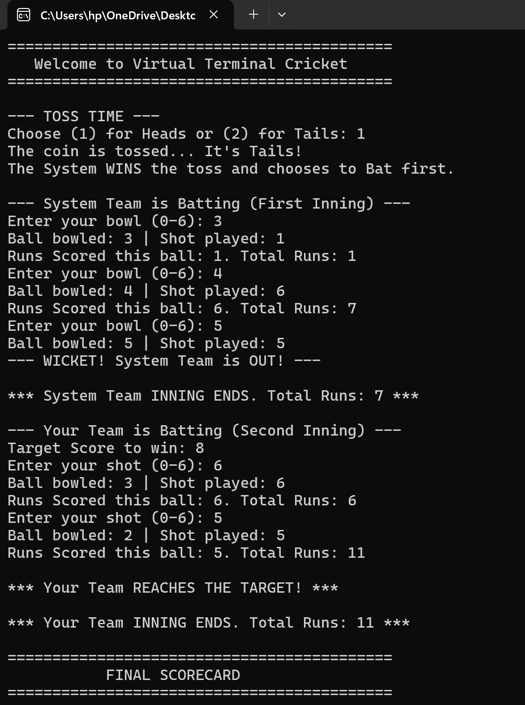
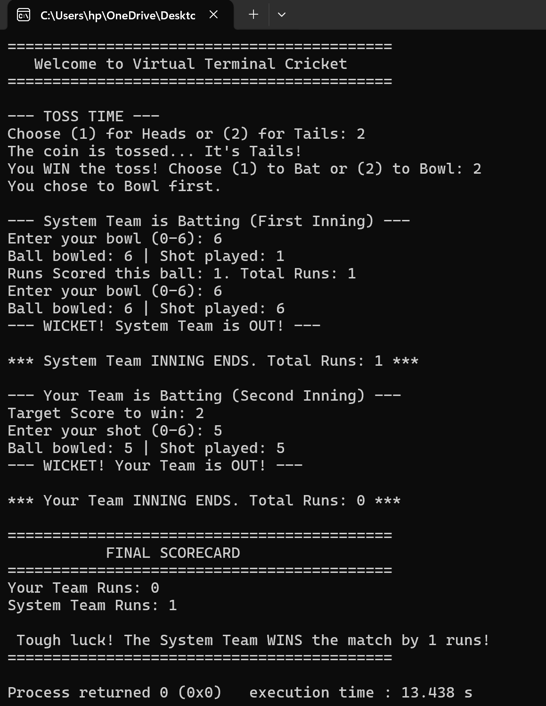

The "Virtual Terminal Cricket" project is a digital adaptation of the popular childhood game known as "Hand Cricket". Hand cricket is a game where players show scores using their fingers, and if the numbers shown by the batsman and bowler match, the batsman is declared "out." This implementation translates these physical mechanics into a terminal-based simulation using the C programming language.

Project Objectives:
1) To simulate a realistic cricket match experience within a command-line interface.
2) To implement game logic including a toss system, batting, and bowling phases.
3) To utilize random number generation to provide a challenging "System" opponent.

Key Features:
1) Toss System: A randomized coin toss where the user chooses "Heads" or "Tails" to decide who bats or bowls first.
2) Dynamic Scorekeeping: Real-time updates of runs scored and the total score during each inning.
3) Input Validation: Robust error handling to ensure users only enter valid numbers between 0 and 6.
4) Target Chasing: A target is set after the first innings, and the second team must chase it to win.
The program utilizes standard C libraries such as <stdio.h> for input/output, <stdlib.h> for utility functions, and <time.h> to seed the random number generator, ensuring that every game played is unique.

Results:

!img-src='Result1.png'

